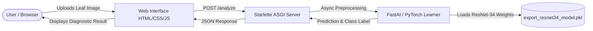

# 🌱 Plant Disease Detection System

[](https://www.python.org/)
[](https://docs.fast.ai/)
[](https://pytorch.org/)
[](https://www.starlette.io/)
[](https://www.docker.com/)
[](https://opensource.org/licenses/MIT)

> **Author:** **Apoorva Srivastava**

---

## 📌 Overview

The **Plant Disease Detection System** is an end-to-end deep learning web application engineered to diagnose and classify **38 different plant diseases and healthy conditions** across 14 vital crop species from leaf imagery.

Early diagnosis of crop diseases is essential for preventing significant agricultural yield loss. This project leverages state-of-the-art Convolutional Neural Networks (CNNs) trained on the **PlantVillage** dataset, packaged within a high-performance, asynchronous ASGI web service for real-time inference.

---

## ✨ Key Features

- **High Accuracy Classification:** Powered by a transfer-learned **ResNet-34** architecture achieving **>99.2% accuracy** on the PlantVillage validation set using cyclical learning rates (1-cycle policy).
- **Multi-Crop Support:** Diagnoses foliar diseases across **14 agricultural crops** (Apple, Blueberry, Cherry, Corn, Grape, Orange, Peach, Bell Pepper, Potato, Raspberry, Soybean, Squash, Strawberry, Tomato).
- **Extensive Model Benchmarks:** Features 9 comprehensive Jupyter research notebooks benchmarking architectures across **FastAI**, **PyTorch**, **TensorFlow**, **Keras**, **DenseNet-121**, **ResNet-50**, **VGG-16**, and **VGG-19**.
- **Real-Time Asynchronous Backend:** Built using **Starlette** and **Uvicorn** for non-blocking, lightning-fast inference.
- **Interactive UI:** Clean, responsive web interface with live image preview and instant diagnostic feedback.
- **Automated Weight Provisioning:** Automatically downloads the pre-trained weights (`export_resnet34_model.pkl`) upon launch if not present locally.
- **Containerized & Cloud Ready:** Comes equipped with a production-ready `Dockerfile` and `app.yaml` for deployment on Google Cloud App Engine or any container runtime.

---

## 🌿 Supported Crops & Diseases (38 Classes)

| Crop | Classes & Detected Conditions |
| :--- | :--- |
| **Apple** | Apple Scab, Black Rot, Cedar Apple Rust, Healthy |
| **Blueberry** | Healthy |
| **Cherry** | Powdery Mildew, Healthy |
| **Corn (Maize)** | Cercospora Leaf Spot / Gray Leaf Spot, Common Rust, Northern Leaf Blight, Healthy |
| **Grape** | Black Rot, Esca (Black Measles), Leaf Blight (Isariopsis Leaf Spot), Healthy |
| **Orange** | Huanglongbing (Citrus Greening) |
| **Peach** | Bacterial Spot, Healthy |
| **Pepper (Bell)** | Bacterial Spot, Healthy |
| **Potato** | Early Blight, Late Blight, Healthy |
| **Raspberry** | Healthy |
| **Soybean** | Healthy |
| **Squash** | Powdery Mildew |
| **Strawberry** | Leaf Scorch, Healthy |
| **Tomato** | Bacterial Spot, Early Blight, Late Blight, Leaf Mold, Septoria Leaf Spot, Spider Mites (Two-spotted spider mite), Target Spot, Yellow Leaf Curl Virus, Mosaic Virus, Healthy |
| **Background** | Non-plant / Background images |

---

## 🔬 Deep Learning Research & Model Experiments

The project contains in-depth experimentation across various neural network backbones in the `app/notebook/` directory:

| Notebook | Framework / Architecture | Description & Key Results |
| :--- | :--- | :--- |
| `plant_disease_detector.ipynb` | **FastAI / ResNet-34** | Core production model utilizing transfer learning and 1-cycle policy, achieving **>99.1% validation accuracy**. |
| `Plant_Disease_Detection_Fastai.ipynb`| **FastAI** | Additional fine-tuning and validation routines with FastAI vision transforms. |
| `Plant_Disease_VGG16.ipynb` | **PyTorch / VGG-16** | Deep CNN implementation yielding **~93.13% test accuracy**. |
| `Plant_Disease_VGG19.ipynb` | **PyTorch / VGG-19** | Evaluates deeper 19-layer architecture achieving **~92.36% test accuracy**. |
| `Plant_Disease_RESNET50.ipynb` | **PyTorch / ResNet-50** | 50-layer residual network achieving **~89.16% test accuracy**. |
| `Plant_Disease_DenseNet121.ipynb` | **PyTorch / DenseNet-121** | Densely connected convolutional network for feature reuse. |
| `Plant_Detect_PyTorch.ipynb` | **PyTorch** | Native PyTorch training and evaluation pipeline. |
| `Plant_Disease_Detection_Keras.ipynb` | **Keras / TensorFlow** | Custom convolutional layers with Adam optimizer and categorical cross-entropy. |
| `Plant_Disease_Detection_TensorFlow.ipynb` | **TensorFlow** | Native TensorFlow model definition and training workflow. |

---

## 🏗️ System Architecture



---

## 📁 Repository Structure

```
Plant_Disease_Detection/
├── Dockerfile                  # Container build configuration
├── .dockerignore               # Files excluded from Docker builds
├── app.yaml                    # Google Cloud App Engine Flex configuration
├── requirements.txt            # Python package dependencies
├── README.md                   # Project documentation
└── app/
    ├── server.py               # Starlette ASGI backend & prediction service
    ├── models/
    │   └── models.md           # Instructions on model weight persistence
    ├── notebook/               # Model training & comparative research notebooks
    │   ├── plant_disease_detector.ipynb
    │   ├── Plant_Disease_Detection_Fastai.ipynb
    │   ├── Plant_Disease_DenseNet121.ipynb
    │   ├── Plant_Disease_RESNET50.ipynb
    │   ├── Plant_Disease_VGG16.ipynb
    │   ├── Plant_Disease_VGG19.ipynb
    │   ├── Plant_Detect_PyTorch.ipynb
    │   ├── Plant_Disease_Detection_Keras.ipynb
    │   └── Plant_Disease_Detection_TensorFlow.ipynb
    ├── static/                 # Front-end static assets
    │   ├── client.js           # AJAX request & image preview logic
    │   ├── style.css           # Styling and layout
    │   ├── bgd.jpg             # Background hero asset
    │   └── leaf.png            # Favicon & branding graphics
    └── view/
        └── index.html          # Web application UI
```

---

## 🚀 Getting Started

### Prerequisites

- Python 3.7+ (Python 3.7 or 3.8 recommended for fastai v1 compatibility)
- `pip` package manager
- (Optional) Docker for containerized deployment

### 1. Clone the Repository

```bash
git clone https://github.com/imskr/Plant_Disease_Detection.git
cd Plant_Disease_Detection-master
```

### 2. Create a Virtual Environment

```bash
# Windows
python -m venv venv
.\venv\Scripts\activate

# Linux / macOS
python3 -m venv venv
source venv/bin/activate
```

### 3. Install Dependencies

```bash
pip install --upgrade -r requirements.txt
```

### 4. Run the Application

```bash
python app/server.py serve
```

On initial startup, the server will automatically download the pre-trained model file (`export_resnet34_model.pkl`) into `app/models/` if it does not already exist.

Access the application in your browser at:
```
http://localhost:8080
```

---

## 🐳 Running with Docker

You can build and run the container locally without manually configuring Python dependencies:

```bash
# Build the Docker image
docker build -t plant-disease-detector .

# Run the container mapping port 8080
docker run -p 8080:8080 plant-disease-detector
```

Visit `http://localhost:8080` once the container starts.

---

## ☁️ Cloud Deployment (Google Cloud App Engine)

The repository includes an `app.yaml` configured for Google Cloud App Engine (Flexible Environment):

```bash
# Authenticate with Google Cloud
gcloud auth login
gcloud config set project <YOUR_PROJECT_ID>

# Deploy the application
gcloud app deploy app.yaml
```

---

## 🔌 API Endpoints

### 1. Web Interface
- **Endpoint:** `GET /`
- **Description:** Renders the main user interface for leaf upload and diagnosis.

### 2. Disease Prediction
- **Endpoint:** `POST /analyze`
- **Content-Type:** `multipart/form-data`
- **Body Parameter:** `file` (Image file: PNG, JPG, JPEG)
- **Response Format:**
  ```json
  {
    "result": "Tomato___Late_blight"
  }
  ```

---

## 👨‍💻 Author

- **Apoorva Srivastava**

---

## 📚 Acknowledgments & References

- **Dataset:** [PlantVillage Dataset](https://github.com/spMohanty/PlantVillage-Dataset) by David P. Hughes and Marcel Salathé.
- **Deep Learning Library:** [FastAI](https://docs.fast.ai/) & [PyTorch](https://pytorch.org/).
- **Web Framework:** [Starlette](https://www.starlette.io/) & [Uvicorn](https://www.uvicorn.org/).

---

## 📄 License

This project is licensed under the MIT License — see the [LICENSE](LICENSE) file for details.
